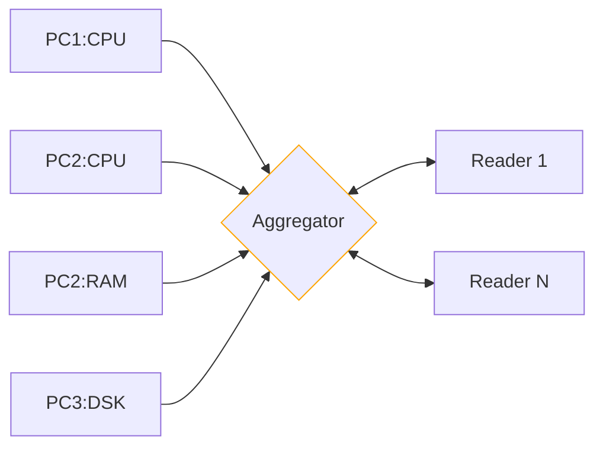

# Practical Work 3 - Distributed System Monitoring

## Dependencies

### Lombok

This project uses [Lombok](https://projectlombok.org/) to generate boilerplate code.
When opening this project in IntelliJ, annotation processing is recommended.
Maven will compile the project without any additional configuration.

### Oshi
This project uses [Oshi](https://github.com/oshi/oshi) to get system information.
Oshi is a cross-platform library that provides information about the hardware and software of the system.

## Build the JAR

To build the JAR, run the following command from the root of the repository:

```shell
./mvnw clean package
```

## Running

To run the JAR, run the following command from the root of the repository:

```shell
java -jar target/pw-distributed-monitoring-1.0.0-SNAPSHOT.jar <command>
```

## Usage

The CLI methods are documented in the form of usage messages, given using the `--help` flag.

```shell
java -jar target/pw-distributed-monitoring-1.0.0-SNAPSHOT.jar --help
```

### Usage
* ```aggregator``` : Starts the aggregator
```text
Usage: DistributedMonitoring aggregator [-v] [-i=<iface>] [-p=<port>]
Start an aggregator server to receive and store metrics
  -i, --iface, --interface=<iface>
                      interface to use
  -p, --port=<port>   server port
  -v                  Change log verbosity. Use -vvv for maximum verbosity.
```

* ```node``` : Starts a node that sends metrics to the aggregator
```text
Usage: DistributedMonitoring node [-v] [--delay=<delay>]
                                  [--frequency=<frequency>] [-h=<hostname>]
                                  [-i=<iface>] -m=<metric> [-p=<port>]
                                  [-sp=<serverPort>]
Start a node unit to send metrics
      --delay=<delay>     delay before sending metrics in seconds
      --frequency=<frequency>
                          frequency of metrics sending in seconds
  -h, --hostname=<hostname>
                          hostname of this node. Default: machine hostname
  -i, --iface, --interface=<iface>
                          interface to use
  -m, --metric=<metric>   metric to send
  -p, --port=<port>       the port to use
      -sp, --server-port=<serverPort>
                          server port
  -v                      Change log verbosity. Use -vvv for maximum verbosity.
```

* ```reader``` : Starts a reader that reads metrics from the aggregator
```text
```

## Concept summary



## Protocol

> [!NOTE]
> The complete version of the protocol is available in [this document](./doc/protocol.pdf).

### Node -> Aggregator

For this part of our architecture, we have decided to use a UDP-type protocol using the fire-and-forget communication 
method. We chose to do multicast so that the aggregator can receive data from all the nodes at the same time.

#### Multicast Addresses
We have decided to use the following multicast addresses for the different types of data:

* ```cpu``` : 230.0.0.1
* ```ram``` : 230.0.0.2
* ```dsk``` : 230.0.0.3

#### Data format

* ```<type>{value=<value>, host=<host>}```
  * ```<type>``` : Type of the data sent (cpu, ram, dsk)
  * ```<value>``` : Value of the sent data
      * cpu : CPU consumption in percentage
      * ram : RAM consumption in MB
      * dsk : Disk consumption in MB
  * ```<host>``` : Name of the machine sending the data (hostname). Must be unique for each machine.

### Reader <-> Aggregator
In this part of the architecture, we have decided to use a UDP-type protocol in Unicast mode and using the request-response
communication method. We chose to do unicast so that the reader can receive specific data from the aggregator.

#### Data format
##### From reader to aggregator
* ```GET_EMITTERS``` : Request to get the list of emitters
* ```GET_EMITTER <emitter>``` : Request to get the values of a specific emitter
  * ```<emitter>``` : Hostname of the emitter to get the values from


