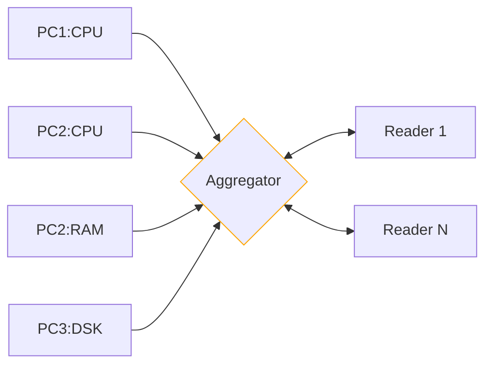

# Practical Work 3 - Distributed System Monitoring

## Concept summary

Any PC can send data to the aggregator in a fire-and-forget manner.

Readers can then access the aggregated results from the different system producers using
a simple messaging protocol able to filter 
