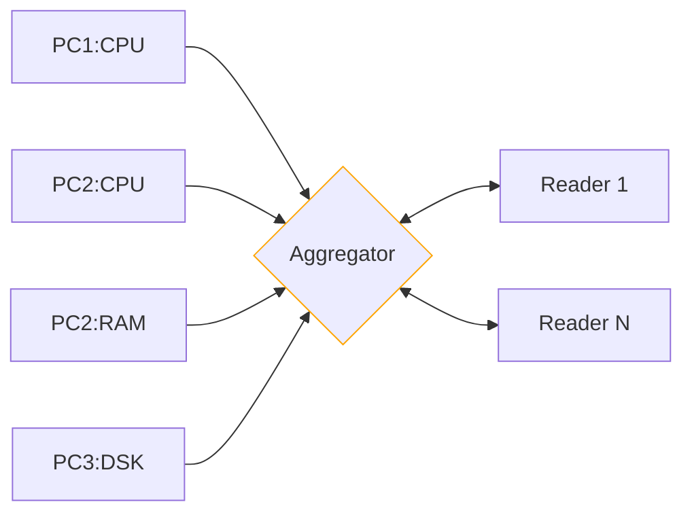
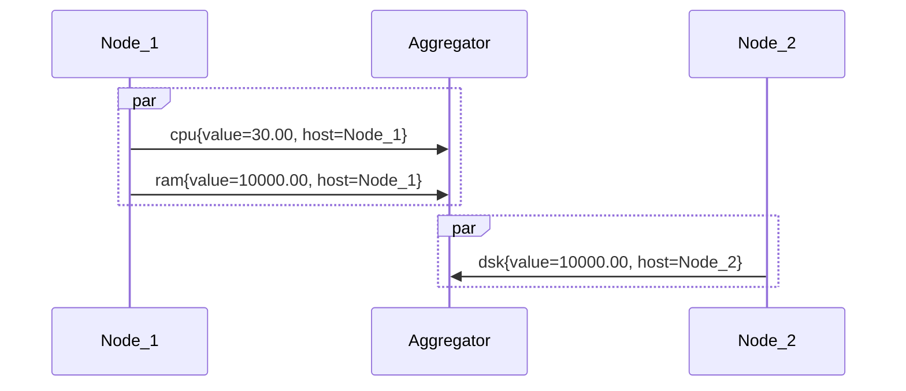
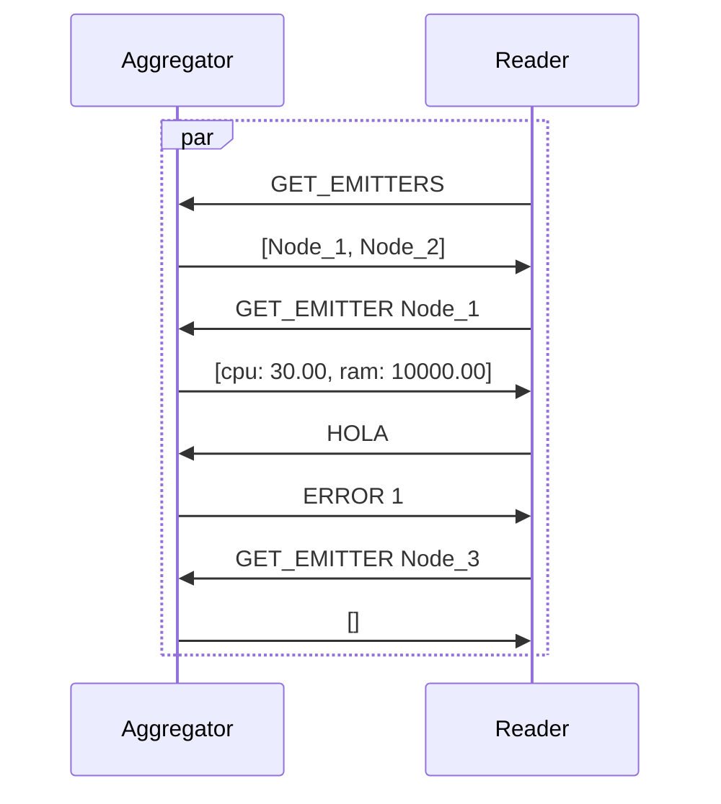
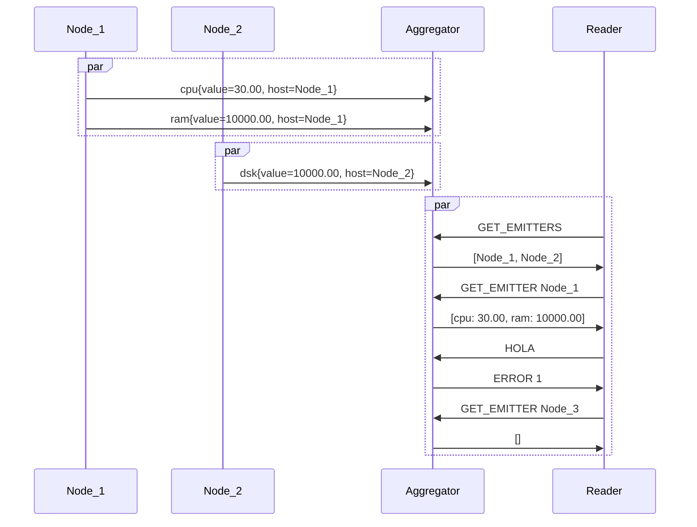

# Practical Work 3 - Distributed System Monitoring



## Dependencies

### Lombok

This project uses [Lombok](https://projectlombok.org/) to generate boilerplate code.
When opening this project in IntelliJ, annotation processing is recommended.
Maven will compile the project without any additional configuration.

### Oshi
This project uses [Oshi](https://github.com/oshi/oshi) to get system information.
Oshi is a cross-platform library that provides information about the hardware and software of the system.

## Building and running with Docker

Pre-built images are built using [Google Jib](https://github.com/GoogleContainerTools/jib) efficiently for each
commit on the `main` branch.
These images are available with the `dev` tag on the
[packages of this repository](https://github.com/heig-lherman/dai-pw03/pkgs/container/dai-pw03)

If one wants to build the images locally, the following command can be used that uses a multi-stage build to build the
JAR and then build the image:

```shell
docker build -t dai-pw03:dev .
```

Using Docker compose, a set of nodes and an aggregator can easily be started:

```shell
docker-compose up
```

This will start 4 nodes and 1 aggregator with the 6343 port open for UDP, one can then use either the image
or a locally built JAR to start a reader:

```shell
docker run --rm -it ghcr.io/heig-lherman/dai-pw03 reader -H <aggregator-ip>
```

Where `<aggregator-ip>` is the IP address of the host server, in the docker compose case above you should input
the gateway to the docker local subnet (often in the form of `172.21.0.1`).

## Build and running without Docker

This project can also be packaged and run without using Docker.

### Packaging the JAR
To build the JAR without using the Docker image, run the following command from the root of the repository:

```shell
./mvnw clean package
```

### Running

To run the JAR, run the following command from the root of the repository:

```shell
java -jar target/pw-distributed-monitoring-1.0.0-SNAPSHOT.jar <command>
```

## Usage

The CLI methods are documented in the form of usage messages, given using the `--help` flag.

```shell
java -jar target/pw-distributed-monitoring-1.0.0-SNAPSHOT.jar --help
```

Giving
  
```text
Usage: DistributedMonitoring [-hVv] [COMMAND]
Aggregate monitoring data from multiple sources.
  -h, --help      Show this help message and exit.
  -v              Change log verbosity. Use -vvv for maximum verbosity.
  -V, --version   Print version information and exit.
Commands:
  help        Display help information about the specified command.
  aggregator  Start an aggregator server to receive and store metrics
  node        Start a node unit to send metrics
  reader      Start a reader client to fetch metrics
```

### Commands

* ```aggregator``` : Starts the aggregator
```text
Usage: DistributedMonitoring aggregator [-hVv] [-i=<iface>] [-O=<metricsPort>]
                                        [-p=<serverPort>]
Start an aggregator server to receive and store metrics
  -h, --help      Show this help message and exit.
  -i, --iface, --interface=<iface>
                  interface to use for metrics collection
  -O, --metrics-port=<metricsPort>
                  server port for metrics
  -p, --server-port=<serverPort>
                  server port for request
  -v              Change log verbosity. Use -vvv for maximum verbosity.
  -V, --version   Print version information and exit.
```

* ```node``` : Starts a node that sends metrics to the aggregator
```text
Usage: DistributedMonitoring node [-hVv] [--delay=<delay>]
                                  [--frequency=<frequency>] [-H=<hostname>]
                                  [-i=<iface>] -m=<metric> [-p=<port>]
Start a node unit to send metrics
      --delay=<delay>     delay before sending metrics in seconds
      --frequency=<frequency>
                          frequency of metrics sending in seconds
  -h, --help              Show this help message and exit.
  -H, --hostname=<hostname>
                          hostname of this node. Default: machine hostname
  -i, --iface, --interface=<iface>
                          interface to use
  -m, --metric=<metric>   metric to send
  -p, --port=<port>       server port
  -v                      Change log verbosity. Use -vvv for maximum verbosity.
  -V, --version           Print version information and exit.
```

* ```reader``` : Starts a reader that reads metrics from the aggregator
```text
Usage: DistributedMonitoring reader [-hVv] [-H=<ipAddress>] [-p=<port>]
Start a reader client to fetch metrics
  -h, --help               Show this help message and exit.
  -H, --host=<ipAddress>   server host IP address
  -p, --port=<port>        server port
  -v                       Change log verbosity. Use -vvv for maximum verbosity.
  -V, --version            Print version information and exit.
```

## Protocol

> [!NOTE]
> The complete version of the protocol is available in [multicast protocol](./doc/protocol-multicast.pdf)
> and [unicast protocol](./doc/protocol-unicast.pdf).

### Node -> Aggregator

For this part of our architecture, we have decided to use a UDP-type protocol using the fire-and-forget communication 
method. We chose to do multicast so that the aggregator can receive data from all the nodes at the same time.

#### Multicast Addresses
We have decided to use the following multicast addresses for the different types of data:

* ```cpu``` : 230.0.0.1
* ```ram``` : 230.0.0.2
* ```dsk``` : 230.0.0.3

#### Data format

* ```<type>{value=<value>, host=<host>}```
  * ```<type>``` : Type of the data sent (cpu, ram, dsk)
  * ```<value>``` : Value of the sent data
      * cpu : CPU consumption in percentage
      * ram : RAM consumption in MB
      * dsk : Disk consumption in MB
  * ```<host>``` : Name of the machine sending the data (hostname). Must be unique for each machine.

#### Messages examples


### Reader <-> Aggregator
In this part of the architecture, we have decided to use a UDP-type protocol in Unicast mode and using the request-response
communication method. We chose to do unicast so that the reader can receive specific data from the aggregator.

#### Data format

##### From reader to aggregator
* ```GET_EMITTERS``` : Request to get the list of emitters
* ```GET_EMITTER <emitter>``` : Request to get the values of a specific emitter
  * ```<emitter>``` : Hostname of the emitter to get the values from

##### From aggregator to reader

* ```[<emitter>, ...]``` : List of emitters. Empty if there is no emitter.
  * ```<emitter>``` : Hostname of the emitter
* ```[<metric>: <value>, ...]``` : List of values for the requested emitter. The list limit is 10 values and can be empty if the emitter does not exist.
  * ```<metric>``` : Type of the data sent (CPU, RAM, DSK)
  * ```<value>``` : Value of the sent data
    * cpu : CPU consumption in percentage
    * ram : RAM consumption in MB
    * dsk : Disk consumption in MB
* ```ERROR <ErrorNum>``` : Send an error to the reader
  * ```<ErrorNum>``` : Error number
    * ```1``` : The message could not be parsed


#### Messages examples

#### Messages examples
###### MDSMP (Multicast Distributed Server Monitoring Protocol) and UDSMP (Unicast Distributed Server Monitoring Protocol) working together

